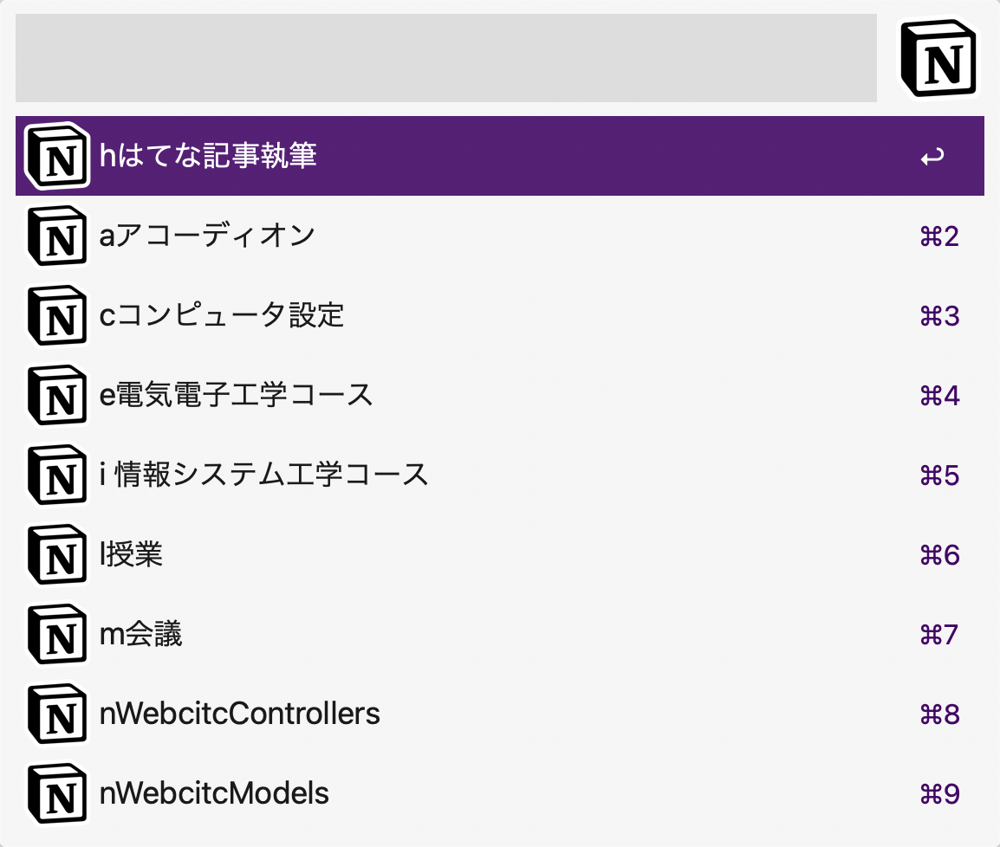
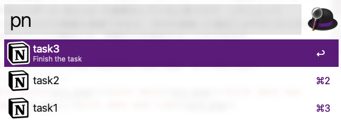
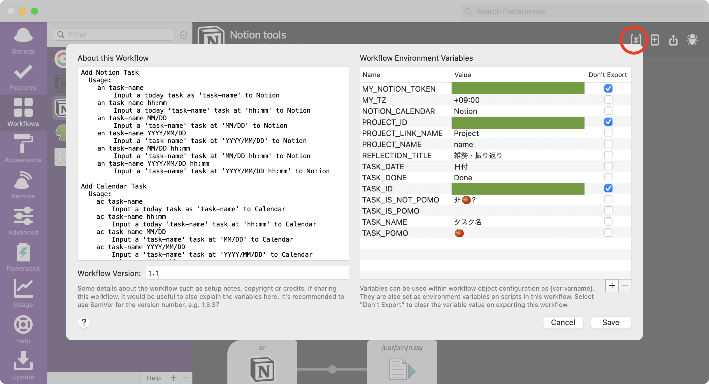

# notion-tools-alfred-workflow

Notion のタスクデータベースの追加・変更を行う Workflow です。

この workflow ではアップデートのために [OneUpdater](https://github.com/vitorgalvao/alfred-workflows/tree/master/OneUpdater)を利用しています。

## キーワード

### an: Notion にタスクを直接登録する / anc: タスクを Notion とカレンダーに同時登録

単にタスク名、日付、時間を記述すると、Task データベースに登録します。
時間を省略すると終日タスクになり、日付も省略すると今日のタスクになります。
「anc」コマンドの場合には同時にカレンダーも同時に登録します。

タイトルのみ|日付も指定|開始時間も指定|開始・終了時間も指定|
:-:|:-:|:-:|:-|
|||||

実行すると、関連するプロジェクトの一覧が表示されるので、適切なプロジェクトを選びます。
なお、このプロジェクト一覧は内部にキャッシュされるため、二回目からは Notion へアクセスすることはありません。
もし、プロジェクトリストを再読み込みしたい場合には、`shift` + `return`をタイプしてください。
|プロジェクトの選択|強制的なプロジェクト読み込み (shift + return)|
:-:|:-:
|||

### ac: カレンダーにタスクを登録する

使い方は上と同じで Notion ではなく、カレンダーアプリに登録します。多くの人がカレンダーと Notion の連携をしていると思うので、これによって Notion タスクの登録も実施できます。日付を省略した場合には今日になります。今日のイベントの場合には、時間だけを指定することもできます。

タイトルのみ|日付も指定|開始時間も指定|開始・終了時間も指定|
:-:|:-:|:-:|:-:
|||||

### ar: 今日の振り返りページに箇条書き文章を追加

書かれた文章を毎日の振り返り専用ページに追記します。

### pn: ポモドーロプロパティの設定 / タスクの終了

「pn」だけタイプすると未終了のタスク一覧が表示されるので、ポモドーロを設定したいタスクを選択します。次に設定するポモドーロ候補が表示されるので、設定したいポモドーロを選択します。

なお、タスクを終了したい場合には、選択時に`Shift`キーを押すとサブタイトルに「Finish the Task」と表示されます。この状態のまま選択をするとタスクを終了させることができます。
Select task|Select pomodoro|Finish the task|
:-:|:-:|:-:
|||

### ot: 今日のタスクを開く / タスクの終了

「ot」だけタイプすると未終了のタスク一覧が表示されるので、表示したいタスクを選択します。環境変数の`OPEN_BY_APP`が`true`に設定されている場合には、Notion のデスクトップアプリで、`false`に設定されている場合にはデフォルトのブラウザでタスクが開きます。

### doit: 日付未設定のタスクを今日実行する

「doit」だけタイプすると、日付が未設定のタスク一覧が表示されるので、今すぐ実行したいタスクを選択します。選択されたタスクの日付が今日の日付になります。

## Workflow Variables

- `MY_NOTION_TOKEN`: API 連携で取得した NOTION Token を設定してください。
- `TASK_ID`: タスクデータベースの ID を設定してください(32桁の16進数です)。
- `PROJECT_ID`: プロジェクトデータベースの ID を設定してください(32桁の16進数です)。
- `MY_TZ`: タイムゾーンを設定してください。デフォルトは日本の "+09:00"に設定されています。
- `TASK_DATE`: タスクデータベースの日付プロパティ(Date)の名前を設定してください。
- `TASK_POMO`: タスクデータベースのポモドーロプロパティ(Multi Select)を設定してください。NFC-NFD の問題から濁点・半濁点のひらがな・カタカナは使えないので、`ポモ`のような属性の場合には名前を変更してください。
- `TASK_DONE`: タスクデータベースの終了フラグプロパティ(Checkbox)を設定してください。
- `TASK_IS_NOT_POMO`: (Optional) もし、ポモドーロタスクと非ポモドーロタスクをフラグで分けている場合には、非ポモドーロの時に true になるプロパティ名を設定してください。ない場合には設定しないでください。
- `TASK_IS_POMO`: (Optional) もし、ポモドーロタスクと非ポモドーロタスクをフラグで分けている場合には、ポモドーロの時に true になるプロパティ名を設定してください。
- `PROJECT_NAME`: プロジェクトデータベースのタイトルの名前を設定してください。TASK_POMO と同じで`プロジェクト名`のような濁点・半濁点の名前は避けてください。
- `PROJECT_LINK_NAME`: タスクデータベースからプロジェクトにリンクしている Relation の名前を設定してください。ここも TASK_POMO と同じで`プロジェクト`のような名前は避けてください。
- `REFLECTION_TITLE`: 「ar」で使う日々の振り返り用のページタイトルの先頭部分を設定してください。私の場合は「雑務・振り返り」としています。
- `NOTION_CALENDAR`: 「ac」で使う Notion 用のカレンダー名を設定してください。
- `OPEN_BY_APP`: タスクをアプリで開く場合には「true」、ブラウザで開く場合には「false」に設定してください。

## 使い方

### Notion setup

この workflow では、二つのデータベース(Task と Project)を必要としています。
Task ページは一つの Project のページに属している形になります。
[サンプルテンプレート](https://www.notion.so/Sample-database-for-notion-tools-alfred-workflow-5b5556f7fec84468ad1e4fe2bdea2db3)を用意したので、こちらを確認してください。

### Notion API の設定

次に、API の設定を行います。詳しく書くと大変なので、[本家の Getting Started ページ](https://developers.notion.com/docs/getting-started) を読んでください。
ここで、Notion にアクセスする`MY_NOTION_TOKEN`と、二つのデータベースの ID(`TASK_ID` と `PROJECT_ID`)を記録しておいてください。また、二つのデータベースは、設定した Integration を招待しておいてください。

### workflow 環境変数 の設定

Alfred workflow の右上の `[x]` アイコンで workflow 環境変数が設定できます。上の説明をみて、該当する
Notion API の設定で記録した 3 つの属性を設定すると同時に、上記の説明のように自分のタスクデータベースに合わせて属性名などを設定してください。

### キーワードの変更とアイコンの変更 (Optional)

キーワードなどは自分の環境に合わせて変更してください。

## Download

[https://github.com/hkob/notion-tools-alfred-workflow/releases/latest/download/Notion.tools.alfredworkflow]
